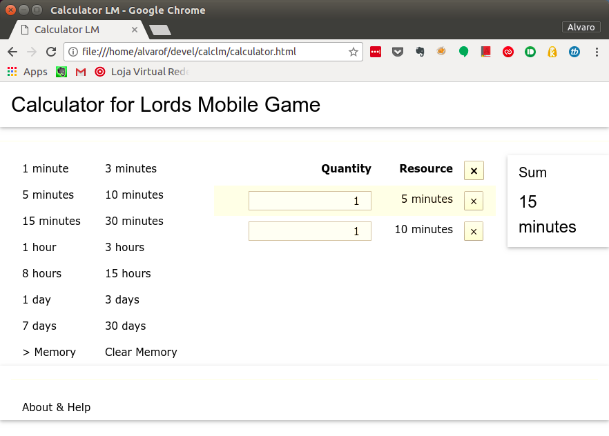
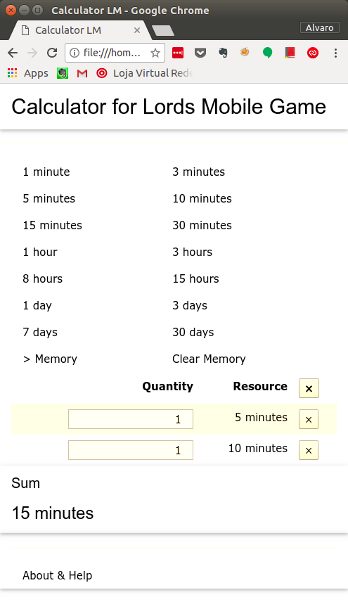

# Calculator for Lords Mobile game

This calculator can helps you sum up the accelerators/speed ups from Lords Mobile game. It runs on most modern browsers and should work equally well on desktops, laptops, tablets and mobiles.

<!--  -->

<!--  -->

## How to use

Use the Time Interval buttons (minutes, hours and days), then place the correspondig quantity of accelerators and see the result on the display at the end (near the word "Sum").

Press the Remove buttons (&times;) to delete each accelerator. To remove all them at once, choose the Remove button located at the top, near the "Resource" header.

The buttons Store to Memory and Clear Memory can reserve a previous result to add up to another set of accelerators.

## Install

Download the `calculator.html` file and open it with your browser.

## About

If necessary you can ask for support by sending a message to the [author](email:alvfig666@gmail.com) or contacting Lady WB on Lords Mobile game.

This project is on [Github](https://github.com/alvfig/calclm).

## Disclaimer

The author was learning AngularJS and W3.CSS when begun this project.
